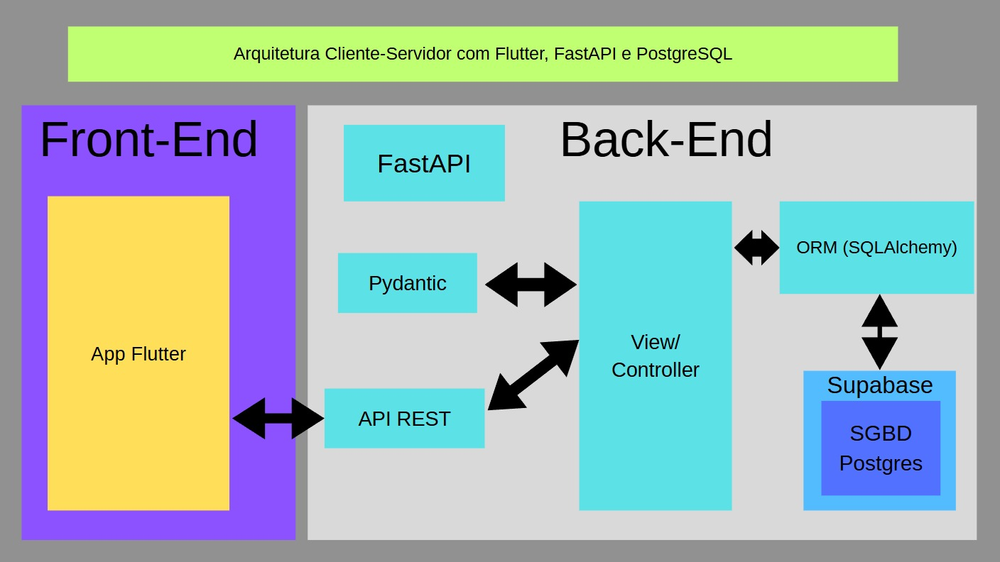

# Projeto Arquitetural do Software

Documento construído a partido do **Modelo BSI - Doc 005 - Documento de Projeto Arquitetual do Software** que pode ser encontrado no
link:https://docs.google.com/document/d/1i80vPaInPi5lSpI7rk4QExnO86iEmrsHBfmYRy6RDSM/edit?usp=sharing

## Descrição da Arquitetura do Projeto

A arquitetura do Sistema da Bonelaria Militar segue um modelo cliente-servidor, com o frontend desenvolvido em Flutter (usando a linguagem Dart) para aplicações mobile e o backend implementado com FastAPI, um framework web moderno e de alto desempenho baseado em Python.

O banco de dados utilizado é o PostgreSQL, que é hospedado e gerenciado pelo Supabase, oferecendo uma solução prática para armazenamento relacional, sem necessidade de configuração manual de infraestrutura.

Essa estrutura permite uma separação clara entre a interface do usuário (mobile), a lógica de negócios (backend) e o armazenamento de dados (banco), resultando em uma arquitetura moderna, escalável e de fácil manutenção.

## Visão Geral da Arquitetura

Imagem com a organização geral dos componentes da arquitetura do projeto. A arquitetura do sistema utiliza **Flutter** no Front-End para o desenvolvimento da aplicação mobile, e **FastAPI** no Back-End para o processamento da lógica de negócio e exposição de uma API RESTful. O gerenciamento de dados é feito com **PostgreSQL**, sendo hospedado e administrado pelo **Supabase**:

A arquitetura do Sistema da Bonelaria Militar é composta por duas camadas principais: **Front-End** e **Back-End**.

### Front-End

O **Front-End** é responsável pela interface do usuário e pela interação com o sistema. Usamos **Flutter** para o desenvolvimento de aplicativo mobile.

### Back-End

O **Back-End** é responsável por toda a lógica de negócios, processamento de requisições e manipulação dos dados do sistema. Utilizamos o **FastAPI**, um framework moderno e de alto desempenho baseado em **Python**, ideal para a construção de APIs RESTful.

O **FastAPI** é utilizado em conjunto com o **Pydantic** para a validação e serialização de dados, garantindo consistência e segurança nas informações trocadas entre o cliente e o servidor. Para a comunicação com o banco de dados, empregamos o SQLAlchemy, um ORM (Mapeamento Objeto-Relacional) que facilita a interação com o banco relacional.

O **PostgreSQL** é o sistema de banco de dados utilizado, sendo hospedado e gerenciado pelo **Supabase**, que oferece uma infraestrutura escalável e pronta para uso. É nele que armazenamos os dados da aplicação, como informações de produtos, costureiras e controle de materiais.

## Requisitos Não-Funcionais

Requisitos não-funcionais que impactam na arquitetura. Nesta seção do documento, é necessário listar os requisitos não funcionais encontrados no sistema, tais como: portabilidade, usabilidade, desempenho e etc. O objetivo é colocar o nome do requisito e descrever com detalhes suas características.

Segue um exemplo:

Requisito  | Detalhes
---------- | -------------------------------------------- 
Desempenho | 1. A página principal tem que ser carregada em no máximo 3 segundos em uma conexão mínima de 256kbps.  2. As páginas que recuperam informações de sistemas legados, devem responder em dois segundos em uma conexão de 256kbps.  3. As páginas que recuperam informações de transações no banco de dados da própria aplicação, deve responder em um segundo usando paginação real (limit e offset), retornados em uma conexão de 256kbps.  4. O servidor deve suportar 100.000 conexões simultâneas sem perda de desempenho.
Interoperabilidade | 1. Deve ser desenvolvido no sistema linux, criando uma imagem docker do sistema e com banco de dados PostgreSQL 16.

## Mecanismos arquiteturais

Nesta seção do documento, devemos listar os mecanismos arquiteturais encontrados no sistema, ou seja, identificar todos os mecanismos de análise, mecanismo de design e mecanismo de implementação. O intuito desta etapa é verificar e garantir que todas as preocupações técnicas relativas à arquitetura do sistema tenham sido capturadas.

Exemplo:

| Mecanismo de Análise | Mecanismo de Design  | Mecanismo de Implementação |
| -------------------- | -------------------- | -------------------------- |
| Persistência         | Banco de dados relacional | PostgreSQL 16.2       |
| Camada de Dados      | Mapeamento OR             | Django ORM            |
| Frontend  | Interface Usuário | Django Templates, HTML5, JS, Bootstrap 5 |
| Backend              | REST                  | Django REST Framework     |
| Build                | Imagem Docker            | Docker e Dockerfile    |
| Deploy               | Container Docker         | Docker compose         |

# Implantação

O arquiteto deve descrever as configurações de distribuição dos componentes de software na área física em que serão implantados.

# Referências

Links utilizados como referência sobre Arquitetura de Software e documentação de Arquiteturas.

https://edisciplinas.usp.br/pluginfile.php/134335/mod_resource/content/1/Aula13_ArquiteturaSoftware_02_Documentacao.pdf

http://www.linhadecodigo.com.br/artigo/3343/como-documentar-a-arquitetura-de-software.aspx

http://diatinf.ifrn.edu.br/prof/lib/exe/fetch.php?media=user:1301182:disciplinas:arquitetura:exemplo-arquitetura-01.pdf

Peter Eeles; Peter Cripps. The Process of Software Architecting, Addison-Wesley Professional, 2009.

Paul Clements; Felix Bachmann; Len Bass; David Garlan; James Ivers; Reed Little; Paulo Merson; Robert Nord; Judith Stafford. Documenting Software Architectures: Views and Beyond, Second Edition, Addison-Wesley Professional, 2010.
