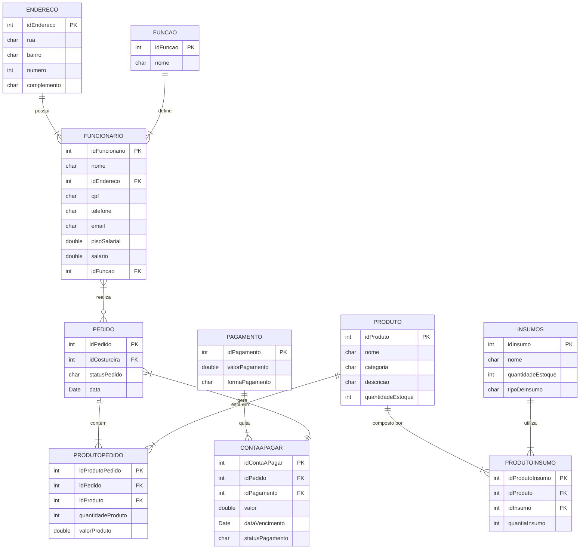

# Contagem de Pontos de Função

A contagem em **Pontos de Função (PF)** permite a determinação do **Tamanho Funcional** do projeto de software.
A análise de ponto de função (APF) é um processo para a identificação e contagem das funcionalidades baseadas nos conceitos 
de **Funções de Dados** e **Funções de Transação**. 

Os conceitos relacionados com dados são os **Arquivos de Lógica Interna (ALI)** e os **Arquivos de Interface Externa (AIE)**, 
e os conceitos relacionados com operações externas a fronteira do sistema são: 
**Entrada Externa (EE)**, **Consulta Externa (CE)** e **Saída Externa (SE)**.

Existem várias práticas de contagem, cada uma com suas especificidades.

## Contagem Indicativa

Na contagem indicativa (Ci) só é necessário conhecer e analisar as **Funções de Dados**. Desta forma, 
os **ALI**s (Arquivos Lógicos Internos) com o valor de *35 PF* cada e os **AIE**s (Arquivos de Interface Externa) com o valor de *15 PF* cada.

### Modelo de Dados 

### Contagem Indicativa

| Função de Dado       | Entidades Relacionadas        | Tamanho em PF |
| -------------------- | ----------------------------- | :-----------: |
| ALI Funcionário      | FUNCIONARIO, ENDERECO, FUNCAO |     35 PF     |
| ALI Pedido           | PEDIDO, PRODUTOPEDIDO         |     35 PF     |
| ALI Produto          | PRODUTO, PRODUTOINSUMO        |     35 PF     |
| ALI Insumos          | INSUMOS                       |     35 PF     |
| ALI Pagamento/Contas | PAGAMENTO, CONTAAPAGAR        |     35 PF     |
| ALI Endereço         | ENDERECO                      |     35 PF     |
| **Total**            | **Ci**                        |   **210 PF**  |

### Contagem Detalhada (Cd)

|     Descrição        |   Tipo   |   RLR   |   DER   |   Complexidade   |   Tamanho em PF    |
| ------------------   | -------- | ------- | ------- | ---------------- | :---------------:  |
| ALI Funcionário      |   ALI    |    3    |    9    |      Média       | 9 PF               |
| ALI Pedido           |   ALI    |    2    |    3    |      Baixa       | 6 PF               |
| ALI Produto          |   ALI    |    2    |    4    |      Baixa       | 6 PF               |
| ALI Insumos          |   ALI    |    1    |    3    |      Baixa       | 6 PF               |
| ALI Pagamento/Contas |   ALI    |    2    |    7    |      Média       | 9 PF               |
| ALI Endereço         |   ALI    |    1    |    4    |      Baixa       | 6 PF               |
|  **Descrição**       | **Tipo** | **ALR** | **DER** | **Complexidade** | **Tamanho em PF**  |
| Cadastrar Funcionário        | EE   | 3   | 6   | Média        |      4 PF     |
| Atualizar Funcionário        | EE   | 3   | 6   | Média        |      4 PF     |
| Consultar Funcionário        | CE   | 3   | 6   | Média        |      4 PF     |
| Excluir Funcionário          | EE   | 1   | 6   | Baixa        |      3 PF     |
| Cadastrar Pedido             | EE   | 3   | 5   | Alta         |      5 PF     |
| Atualizar Pedido             | EE   | 2   | 6   | Média        |      4 PF     |
| Consultar Pedido             | CE   | 2   | 5   | Média        |      4 PF     |
| Consultar Detalhes do Pedido | CE   | 2   | 5   | Média        |      4 PF     |
| Excluir Pedido               | EE   | 3   | 6   | Média        |      4 PF     |
| Cadastrar Produto            | EE   | 2   | 5   | Média        |      4 PF     |
| Atualizar Produto            | EE   | 3   | 6   | Média        |      4 PF     |
| Consultar Produto            | CE   | 2   | 5   | Média        |      4 PF     |
| Excluir Produto              | EE   | 2   | 5   | Baixa        |      4 PF     |
| Cadastrar Insumo             | EE   | 1   | 3   | Baixa        |      3 PF     |
| Atualizar Insumo             | EE   | 1   | 3   | Baixa        |      3 PF     |
| Atualizar Estoque de Insumo  | EE   | 1   | 2   | Média        |      4 PF     |
| Gerar Conta a Pagar          | CE   | 2   | 4   | Média        |      4 PF     |
| Consultar Contas a Pagar     | CE   | 2   | 4   | Média        |      4 PF     |
| Registrar Pagamento          | SE   | 2   | 3   | Alta         |      5 PF     |
|   **Total**                  |      |     |     |   **Cd**     |   **117 PF**  |

| Tipo            | Quantidade | Pontos de Função |
| --------------- | ---------- | ---------------- |
| ALI             | 6          | 42 PF            |
| AIE             | 0          | 0  PF            |
| EE              | 12         | 46 PF            |
| CE              | 6          | 24 PF            |
| SE              | 1          | 5 PF             |
| **Total Geral** | **–**      | **117 PF**       |