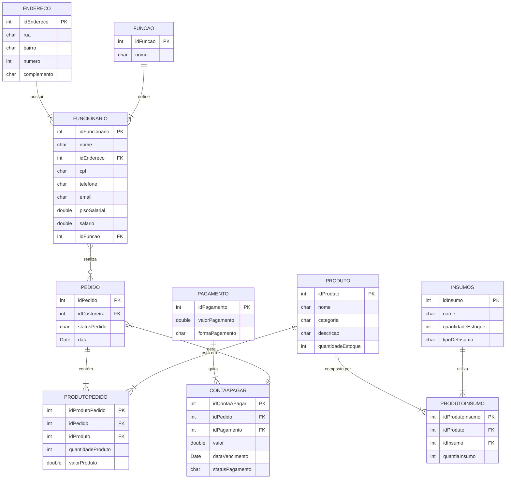

# Contagem de Pontos de Função

A contagem em **Pontos de Função (PF)** permite a determinação do **Tamanho Funcional** do projeto de software.
A análise de ponto de função (APF) é um processo para a identificação e contagem das funcionalidades baseadas nos conceitos 
de **Funções de Dados** e **Funções de Transação**. 

Os conceitos relacionados com dados são os **Arquivos de Lógica Interna (ALI)** e os **Arquivos de Interface Externa (AIE)**, 
e os conceitos relacionados com operações externas a fronteira do sistema são: 
**Entrada Externa (EE)**, **Consulta Externa (CE)** e **Saída Externa (SE)**.

Existem várias práticas de contagem, cada uma com suas especificidades.

## Contagem Indicativa

Na contagem indicativa (Ci) só é necessário conhecer e analisar as **Funções de Dados**. Desta forma, 
os **ALI**s (Arquivos Lógicos Internos) com o valor de *35 PF* cada e os **AIE**s (Arquivos de Interface Externa) com o valor de *15 PF* cada.

### Modelo de Dados 

### Contagem Indicativa

| Função de Dado       | Entidades Relacionadas        | Tamanho em PF |
| -------------------- | ----------------------------- | :-----------: |
| ALI Funcionário      | FUNCIONARIO, ENDERECO, FUNCAO |     35 PF     |
| ALI Pedido           | PEDIDO, PRODUTOPEDIDO         |     35 PF     |
| ALI Produto          | PRODUTO, PRODUTOINSUMO        |     35 PF     |
| ALI Insumos          | INSUMOS                       |     35 PF     |
| ALI Pagamento/Contas | PAGAMENTO, CONTAAPAGAR        |     35 PF     |
| ALI Endereço         | ENDERECO                      |     15 PF     |
| **Total**            | **Ci**                        |   **190 PF**  |

### Contagem Detalhada (Cd)

|     Descrição      |   Tipo   |   RLR   |   DER   |   Complexidade   |   Tamanho em PF   |
| ------------------ | -------- | ------- | ------- | ---------------- | :---------------: |
|  ALI Usuário       |   ALI    |    2    |    11   |       Baixa      | 7 PF              |
|  ALI Projeto       |   ALI    |         |         |                  |  PF               |
|  ALI Laboratorio   |   ALI    |         |         |                  |  PF               |
|  ALI Endereço      |   AIE    |         |         |                  |  PF               |
|  **Descrição**     | **Tipo** | **ALR** | **DER** | **Complexidade** | **Tamanho em PF** |
|  Inserir Grupo     |    EE    |    1    |    2    |      Baixa       | 3 PF              |
|  Atualizar Grupo   |    EE    |    1    |    2    |      Baixa       | 3 PF              |
|  Consultar Grupo   |    CE    |    1    |    2    |      Baixa       | 3 PF              |
|  Inserir Usuário   |    EE    |    2    |    9    |      Média       | 4 PF              |
|  Atualizar Usuário |    EE    |    2    |    9    |      Média       | 4 PF              |
|  Consultar Usuário |    CE    |    2    |    9    |      Média       | 4 PF              |
|  Detalhar Usuário  |    CE    |    2    |    9    |      Média       | 4 PF              |
|   **Total**        |          |         |         |     **Cd**       | **xx PF**         |

| Descrição                    | Tipo | RLR | DER | Complexidade | Tamanho em PF |
| ---------------------------- | ---- | --- | --- | ------------ | :-----------: |
| Inserir Funcionário          | EE   | 3   | 6   | Média        |      4 PF     |
| Atualizar Funcionário        | EE   | 3   | 6   | Média        |      4 PF     |
| Consultar Funcionário        | CE   | 3   | 6   | Média        |      4 PF     |
| Inserir Pedido               | EE   | 2   | 5   | Média        |      4 PF     |
| Consultar Pedido             | CE   | 2   | 5   | Média        |      4 PF     |
| Consultar Detalhes do Pedido | CE   | 2   | 5   | Média        |      4 PF     |
| Inserir Produto              | EE   | 2   | 5   | Média        |      4 PF     |
| Consultar Produto            | CE   | 2   | 5   | Média        |      4 PF     |
| Inserir Insumo               | EE   | 1   | 3   | Baixa        |      3 PF     |
| Atualizar Estoque de Insumo  | EE   | 1   | 2   | Baixa        |      3 PF     |
| Gerar Conta a Pagar          | SE   | 2   | 4   | Média        |      5 PF     |
| Consultar Contas a Pagar     | CE   | 2   | 4   | Média        |      4 PF     |
| Registrar Pagamento          | EE   | 2   | 3   | Média        |      4 PF     |

| Tipo            | Quantidade | Pontos de Função |
| --------------- | ---------- | ---------------- |
| ALI             | 5          | 38 PF            |
| AIE             | 0          |                  |
| EE              | 6          | 21 PF            |
| CE              | 5          | 20 PF            |
| SE              | 1          | 5 PF             |
| **Total Geral** | **–**      | **84 PF**        |