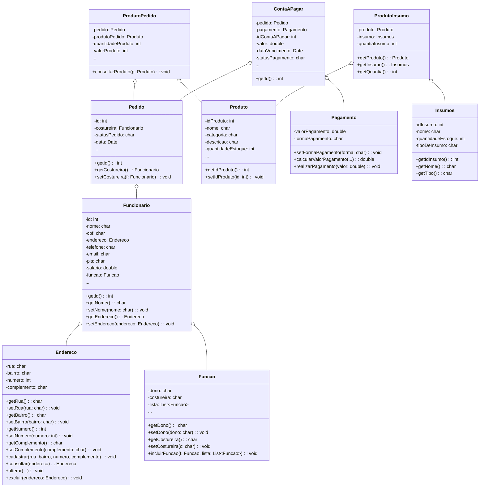
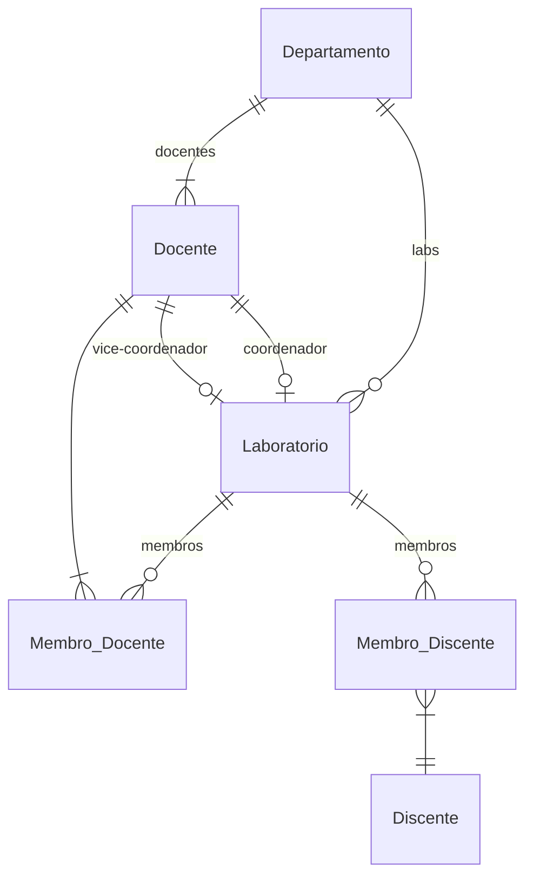

# Documento de Modelos

Neste documento temos o modelo Conceitual (UML) ou de Dados (Entidade-Relacionamento). Temos também a descrição das entidades e o dicionário de dados.

Para a modelagem pode se usar o Astah UML ou o BrModelo. Uma ferramenta interessante para modelos UML é a [YUML](http://yuml.me), no link temos um exemplo de [Modelo UML com YUML](yuml/monitoria-yuml.md). Atualmente é possível usar a ferramenta **Mermaid** segundo o blog do GitHub [Include diagrams in your Markdown files with Mermaid](https://github.blog/2022-02-14-include-diagrams-markdown-files-mermaid/). A documentação do **Mermaid** pode ser encontrada em [Mermaid in GitHub](https://mermaid-js.github.io/mermaid).

## Modelo Conceitual

### Diagrama de Classes usando Mermaid

### Descrição das Entidades

Descrição sucinta das entidades presentes no sistema.

| Entidade | Descrição   |
|----------|------------------------------------------------------------------------------------------------------------------------------------------------------|
| Animal   | Entidade abstrata para representar informações gerais dos Animais: age, gender, isMammal(), mate().                                                  |
| Duck     | Entidade que representa um Pato tem as informações: String beakColor, +swim(), +quack(). A classe Duck estende a classe abstrata Animal. |
| Fish     | Entidade que representa um Peixe tem as informações: sizeInFeet, -canEat(). A classe Peixe estende a classe abstrata Animal.                                                                   |
| Zebra    | Entidade que representa um Zebra tem as informações is_wild, run(). A classe Zebra estende a classe abstrata Animal.                                                                   |

## Modelo de Dados (Entidade-Relacionamento)

Para criar modelos ER é possível usar o BrModelo e gerar uma imagem. Contudo, atualmente é possível criar modelos ER usando a ferramenta **Mermaid**, escrevendo o modelo diretamente em markdown. Acesse a documentação para escrever modelos [ER Diagram Mermaid](https://mermaid-js.github.io/mermaid/#/entityRelationshipDiagram).

### Dicionário de Dados

#### Tabela: Costureira
| Campo     | Descrição                             | Tipo de Dado | Tamanho | Restrições              |
|-----------|---------------------------------------|--------------|---------|-------------------------|
| id        | Identificador da costureira           | SERIAL       | —       | PK / Not Null           |
| nome      | Nome da costureira                    | VARCHAR      | 100     | Not Null                |
| endereco  | Endereço da costureira                | VARCHAR      | 150     | —                       |
| celular   | Celular para contato                  | VARCHAR      | 20      | —                       |
| email     | E-mail da costureira                  | VARCHAR      | 100     | Unique                  |

#### Tabela: Proprietário
| Campo     | Descrição                             | Tipo de Dado | Tamanho | Restrições              |
|-----------|---------------------------------------|--------------|---------|-------------------------|
| id        | Identificador do proprietário         | SERIAL       | —       | PK / Not Null           |
| nome      | Nome do proprietário                  | VARCHAR      | 100     | Not Null                |
| endereco  | Endereço do proprietário              | VARCHAR      | 150     | —                       |
| celular   | Celular para contato                  | VARCHAR      | 20      | —                       |
| email     | E-mail do proprietário                | VARCHAR      | 100     | Unique                  |

#### Tabela: Produto
| Campo            | Descrição                                           | Tipo de Dado | Tamanho | Restrições         |
|------------------|-----------------------------------------------------|--------------|---------|--------------------|
| id               | Identificador do produto                           | SERIAL       | —       | PK / Not Null      |
| nome             | Nome do produto                                    | VARCHAR      | 100     | Not Null           |
| material         | Tipo de material usado                             | VARCHAR      | 100     | —                  |
| metragem_utilizada | Quantidade de material usada (cm²)               | INTEGER      | —       | >= 0               |
| data_fabricacao  | Data de fabricação                                 | DATE         | —       | Not Null           |
| data_retirada    | Data em que foi retirado para confecção            | DATE         | —       | —                  |
| id_costureira    | Referência à costureira responsável                 | INTEGER      | —       | FK → costureira(id) |

#### Tabela: Pedido
| Campo          | Descrição                                           | Tipo de Dado | Tamanho | Restrições           |
|----------------|-----------------------------------------------------|--------------|---------|----------------------|
| id             | Identificador do pedido                            | SERIAL       | —       | PK                   |
| id_produto     | Produto que será confeccionado                      | INTEGER      | —       | FK → produto(id)     |
| id_costureira  | Costureira responsável pelo pedido                  | INTEGER      | —       | FK → costureira(id)  |
| status         | Status atual do pedido (pendente, pronto)          | VARCHAR      | 20      | Default = 'pendente' |
| estimativa_dias| Dias estimados para produção                       | INTEGER      | —       | —                    |
| data_envio     | Data do envio da matéria-prima                     | DATE         | —       | —                    |

#### Tabela: Relatório
| Campo          | Descrição                                           | Tipo de Dado | Tamanho | Restrições         |
|----------------|-----------------------------------------------------|--------------|---------|--------------------|
| id             | Identificador do relatório                         | SERIAL       | —       | PK                 |
| id_costureira  | Referência à costureira                             | INTEGER      | —       | FK → costureira(id)|
| total_produzido| Quantidade de produtos feitos                       | INTEGER      | —       | >= 0               |
| total_receita  | Valor total arrecadado                              | NUMERIC      | 10,2    | >= 0               |
| data_inicio    | Período de início da produção                       | DATE         | —       | —                  |
| data_fim       | Período de fim da produção                          | DATE         | —       | —                  |

#### Tabela: Pagamento
| Campo           | Descrição                                          | Tipo de Dado | Tamanho | Restrições              |
|-----------------|----------------------------------------------------|--------------|---------|-------------------------|
| id              | Identificador do pagamento                        | SERIAL       | —       | PK                      |
| id_costureira   | Referência à costureira                            | INTEGER      | —       | FK → costureira(id)     |
| valor_pago      | Valor pago pela produção                           | NUMERIC      | 10,2    | >= 0                    |
| metodo_pagamento| Método de pagamento selecionado                    | VARCHAR      | 50      | —                       |
| data_pagamento | Data da realização do pagamento                    | DATE         | —       | —                       |
| confirmado      | Confirmação da costureira (true/false)             | BOOLEAN      | —       | Default = false         |
