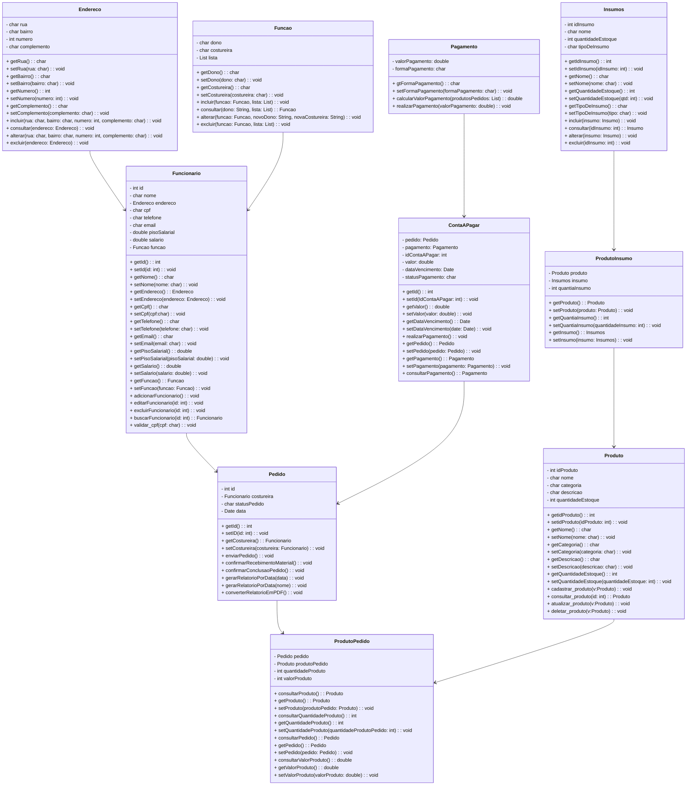
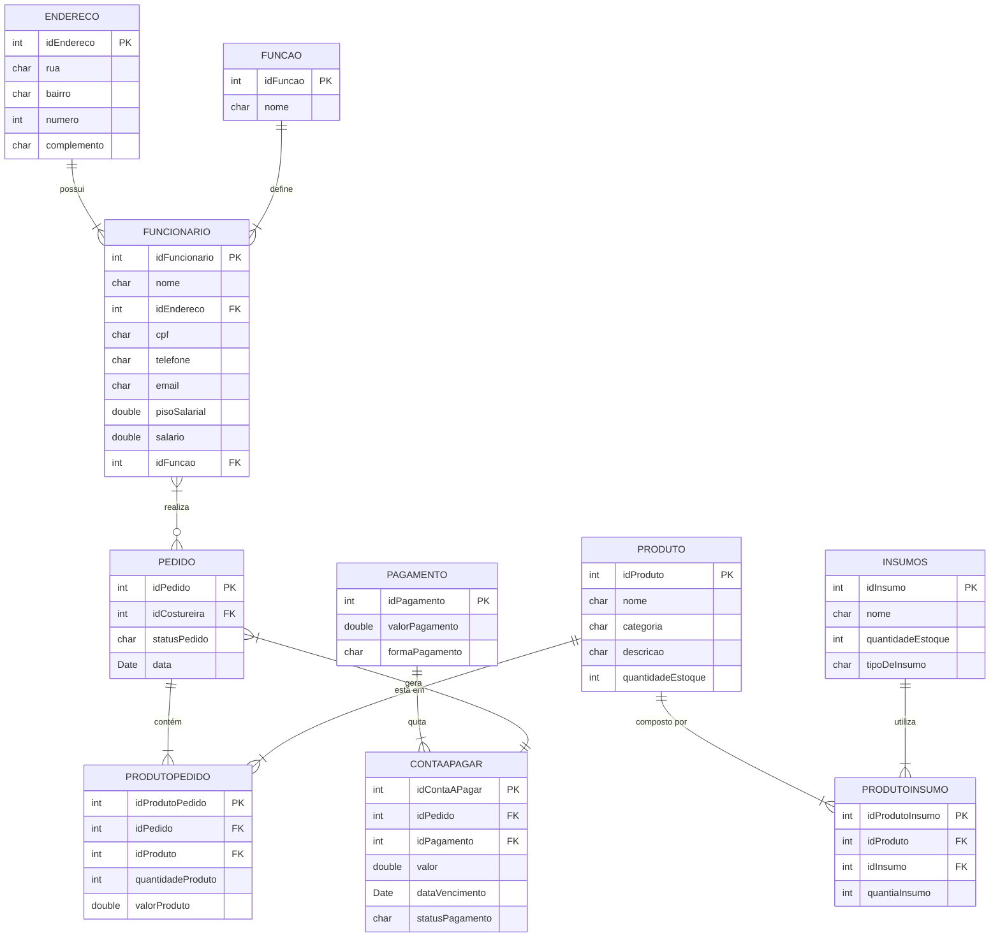

# Documento de Modelos

Neste documento temos o modelo Conceitual (UML) ou de Dados (Entidade-Relacionamento). Temos também a descrição das entidades e o dicionário de dados.

## Modelo Conceitual

### Diagrama de Classes usando Mermaid

### Descrição das Entidades

Descrição sucinta das entidades presentes no sistema.

| Entidade          | Descrição |
|-------------------|-----------|
| **Endereco**       | Representa o endereço de um funcionário, contendo os atributos: rua, bairro, número e complemento. Possui métodos para cadastrar, consultar, alterar e excluir dados. |
| **Funcionario**    | Representa um funcionário da confecção. Contém informações como nome, CPF, telefone, salário, endereço e está associado a uma função. |
| **Funcao**         | Define o tipo de função do funcionário (ex: dono, costureira). Permite operações como inclusão, alteração e exclusão de funções. |
| **Pedido**         | Representa um pedido de produção feito por um funcionário. Armazena informações como ID, data, status e a costureira responsável. |
| **Produto**        | Representa um produto fabricado na confecção. Contém dados como nome, descrição, categoria e quantidade disponível em estoque. |
| **ProdutoPedido**  | Associação entre um pedido e os produtos solicitados. Armazena a quantidade e o valor de cada produto vinculado a um pedido. |
| **ContaAPagar**    | Representa uma conta relacionada a um pedido. Contém valor da conta, status do pagamento, data de vencimento e pagamento realizado. |
| **Pagamento**      | Representa o pagamento de uma conta. Armazena o valor e a forma de pagamento. Realiza cálculo do valor total e efetua o pagamento. |
| **ProdutoInsumo**  | Define a relação entre um produto e os insumos necessários para sua produção, especificando a quantidade de insumos utilizada. |
| **Insumos**        | Representa os materiais utilizados na confecção dos produtos. Contém nome, tipo e quantidade disponível no estoque. |

## Modelo de Dados (Entidade-Relacionamento)

### Dicionário de Dados

### Tabela: ENDERECO

| Campo        | Descrição                  | Tipo de Dado | Tamanho | Restrições    |
|--------------|----------------------------|--------------|---------|----------------|
| idEndereco   | Identificador do endereço  | SERIAL       | —       | PK / Not Null   |
| rua          | Nome da rua                | VARCHAR      | 100     | Not Null        |
| bairro       | Nome do bairro             | VARCHAR      | 100     | Not Null        |
| numero       | Número da residência        | INTEGER      | —       | Not Null        |
| complemento  | Complemento do endereço    | VARCHAR      | 100     | —               |

---

### Tabela: FUNCAO

| Campo      | Descrição                      | Tipo de Dado | Tamanho | Restrições    |
|------------|--------------------------------|--------------|---------|----------------|
| idFuncao   | Identificador da função        | SERIAL       | —       | PK / Not Null   |
| nome       | Nome da função (ex: costureira, dono) | VARCHAR      | 50      | Not Null        |

---

### Tabela: FUNCIONARIO

| Campo         | Descrição                            | Tipo de Dado | Tamanho | Restrições              |
|---------------|----------------------------------------|--------------|---------|--------------------------|
| idFuncionario | Identificador do funcionário           | SERIAL       | —       | PK / Not Null             |
| nome          | Nome completo                          | VARCHAR      | 100     | Not Null                  |
| idEndereco    | FK para o endereço                     | INTEGER      | —       | FK → ENDERECO(idEndereco)|
| cpf           | CPF do funcionário                     | CHAR         | 11      | Unique / Not Null         |
| telefone      | Telefone de contato                    | VARCHAR      | 20      | —                         |
| email         | E-mail do funcionário                  | VARCHAR      | 100     | Unique / Not Null         |
| pisoSalarial  | Piso salarial base                     | NUMERIC      | 10,2    | Not Null / >= 0           |
| salario       | Salário do funcionário                 | NUMERIC      | 10,2    | Not Null / >= pisoSalarial |
| idFuncao      | FK para a função                       | INTEGER      | —       | FK → FUNCAO(idFuncao)     |

---

### Tabela: PEDIDO

| Campo         | Descrição                            | Tipo de Dado | Tamanho | Restrições                      |
|---------------|----------------------------------------|--------------|---------|---------------------------------|
| idPedido      | Identificador do pedido                | SERIAL       | —       | PK / Not Null                   |
| idCostureira  | FK para funcionário que executa o pedido | INTEGER    | —       | FK → FUNCIONARIO(idFuncionario)|
| statusPedido  | Status do pedido (pendente, pronto...) | VARCHAR      | 20      | Default: 'pendente'            |
| data          | Data de criação do pedido              | DATE         | —       | Not Null                        |

---

### Tabela: PRODUTO

| Campo              | Descrição                         | Tipo de Dado | Tamanho | Restrições       |
|--------------------|-----------------------------------|--------------|---------|------------------|
| idProduto          | Identificador do produto          | SERIAL       | —       | PK / Not Null     |
| nome               | Nome do produto                   | VARCHAR      | 100     | Not Null          |
| categoria          | Categoria (boné, calça, etc.)     | VARCHAR      | 50      | Not Null          |
| descricao          | Descrição do produto              | VARCHAR      | 250     | —                 |
| quantidadeEstoque  | Quantidade atual no estoque       | INTEGER      | —       | Default: 0 / >= 0 |

---

### Tabela: PRODUTOPEDIDO

| Campo             | Descrição                              | Tipo de Dado | Tamanho | Restrições                            |
|-------------------|------------------------------------------|--------------|---------|----------------------------------------|
| idProdutoPedido   | Identificador da relação                 | SERIAL       | —       | PK / Not Null                           |
| idPedido          | FK para o pedido                         | INTEGER      | —       | FK → PEDIDO(idPedido)                  |
| idProduto         | FK para o produto                        | INTEGER      | —       | FK → PRODUTO(idProduto)                |
| quantidadeProduto | Quantidade do produto no pedido         | INTEGER      | —       | Not Null / >= 1                         |
| valorProduto      | Valor do produto no momento do pedido   | NUMERIC      | 10,2    | Not Null / >= 0                         |

---

### Tabela: INSUMOS

| Campo              | Descrição                          | Tipo de Dado | Tamanho | Restrições    |
|--------------------|------------------------------------|--------------|---------|----------------|
| idInsumo           | Identificador do insumo            | SERIAL       | —       | PK / Not Null   |
| nome               | Nome do insumo                     | VARCHAR      | 100     | Not Null        |
| quantidadeEstoque  | Quantidade disponível no estoque   | INTEGER      | —       | Default: 0      |
| tipoDeInsumo       | Tipo (tecido, botão, etc.)         | VARCHAR      | 50      | Not Null        |

---

### Tabela: PRODUTOINSUMO

| Campo           | Descrição                             | Tipo de Dado | Tamanho | Restrições                      |
|-----------------|-----------------------------------------|--------------|---------|----------------------------------|
| idProdutoInsumo | Identificador da relação                | SERIAL       | —       | PK / Not Null                    |
| idProduto       | FK para produto                         | INTEGER      | —       | FK → PRODUTO(idProduto)          |
| idInsumo        | FK para insumo                          | INTEGER      | —       | FK → INSUMOS(idInsumo)           |
| quantiaInsumo   | Quantidade do insumo usada no produto   | INTEGER      | —       | Not Null / >= 1                  |

---

### Tabela: PAGAMENTO

| Campo           | Descrição                             | Tipo de Dado | Tamanho | Restrições     |
|-----------------|-----------------------------------------|--------------|---------|----------------|
| idPagamento     | Identificador do pagamento             | SERIAL       | —       | PK / Not Null   |
| valorPagamento  | Valor total do pagamento               | NUMERIC      | 10,2    | Not Null / >= 0 |
| formaPagamento  | Forma de pagamento (PIX, Dinheiro...)  | VARCHAR      | 50      | Not Null        |

---

### Tabela: CONTAAPAGAR

| Campo           | Descrição                               | Tipo de Dado | Tamanho | Restrições                        |
|-----------------|-------------------------------------------|--------------|---------|------------------------------------|
| idContaAPagar   | Identificador da conta                   | SERIAL       | —       | PK / Not Null                      |
| idPedido        | Pedido associado                         | INTEGER      | —       | FK → PEDIDO(idPedido)              |
| idPagamento     | Pagamento relacionado                    | INTEGER      | —       | FK → PAGAMENTO(idPagamento)        |
| valor           | Valor da conta                           | NUMERIC      | 10,2    | Not Null / >= 0                    |
| dataVencimento  | Data de vencimento da conta              | DATE         | —       | Not Null                           |
| statusPagamento | Status do pagamento (pago, pendente...)  | VARCHAR      | 20      | Not Null                           |

