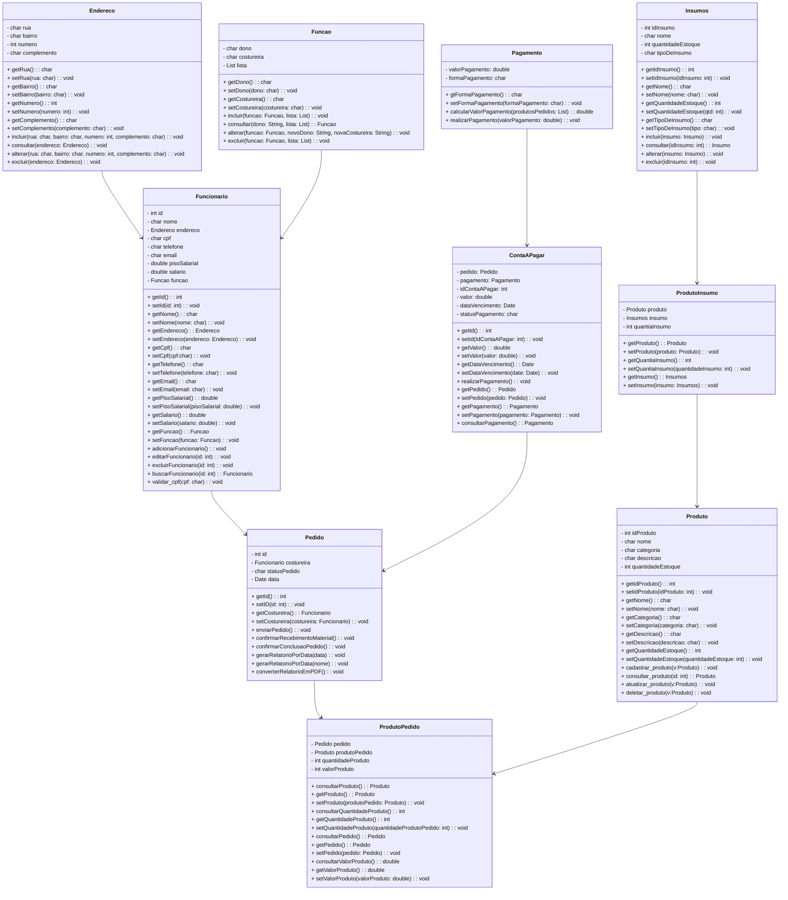
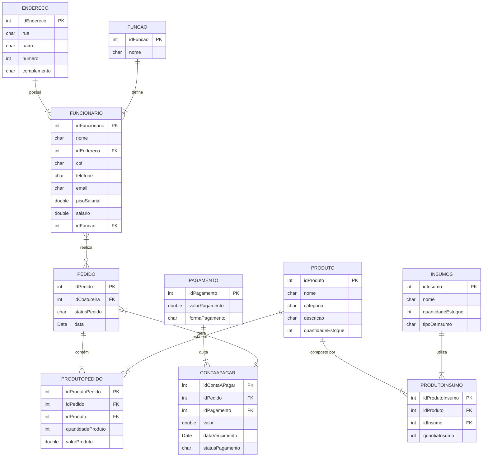

# Documento de Visão (precisa editar)

Documento construído a partido do **Modelo BSI - Doc 001 - Documento de Visão** que pode ser encontrado no
link: https://docs.google.com/document/d/1DPBcyGHgflmz5RDsZQ2X8KVBPoEF5PdAz9BBNFyLa6A/edit?usp=sharing

## Descrição do Projeto

O propósito do Sistema da Bonelaria Militar será desenvolver um sistema de informação para uma confecção de artigos militares, no qual será possível cadastrar os produtos fabricados, cadastrar as costureiras, além de cadastrar as saídas/entradas, cada costureira cadastrada receberá notificações de quando determinada matéria prima sair da fábrica para a sua residência, onde será confeccionado o produto (bonés, chapéus, calções entre outros), e a mesma vai poder confirmar que o produto foi recebido. Em cada costureira registrada, terá o relatório da quantidade de produtos já feitos, juntamente com os preços individuais de cada, no qual no final vai poder ser contabilizado o quanto foi o lucro de cada costureira individualmente de acordo com os produtos fabricados, dessa forma, será possível calcular o salário de forma prática além de trazer informações úteis para análise de dados sobre a produção de cada uma.

## Equipe e Definição de Papéis

Membro     |     Papel   |   E-mail   |
---------  | ----------- | ---------- |
Bruno Costa                | Testador                | bruno.costa.099@ufrn.edu.br
Cláudio Pereira            | Analista                | claudio.pereira.710@ufrn.edu.br
Danilo Gabriel             | Desenvolvedor Back-End  | danilo.brito.715@ufrn.edu.br
Felipe Augusto             | Designer                | felipe.augusto.121@ufrn.edu.br
Mateus Dantas              | Desenvolvedor Front-End | mateus.dantas.125@.ufrn.edu.br
Joacir Dantas de Oliveira  | Cliente                 | bonelariamilitar@gmail.com

### Matriz de Competências

Membro     |     Competências   |
---------  | ----------- |
Cláudio    | Desenvolvedor Python, C, Flutter e Web; Experiência na área de Gestão de processos |
Bruno      | Gestão, Geográfa |
Felipe     | Desenvolvedor Python, C, Dart, Flutter, Web. Experiência em Modelagem de Processos. |
Danilo     | Desenvolvedor Python, C, Flutter, Web. |
Mateus     | Python para Análise de Dados, desenvolvimento em C, Flutter e Web, metodologias ágeis (Scrum). |

## Perfis dos Usuários

O sistema poderá ser utilizado por diversos usuários. Temos os seguintes perfis/atores:

Perfil                                 | Descrição   |
---------                              | ----------- |
Dono da empresa | Ator com acesso geral ao sistema, responsável por fornecer, usar e excluir informações. Além de responsável por dar as rédeas do projeto e requisitos de sistemas, além de prover apoio aos desenvolvedores com informações que podem ajudar a concluir o projeto, tendo acesso amplo do sistema, como, cadastrar proprietário, cadastrar costureiras, enviar pedidos de confecção, cadastrar produtos para serem feitos, gerar relatórios e realizar pagamentos às funcionárias.
Costureiras | Ator com acesso reduzido ao sistema, responsável por receber os pedidos de confecção (assim como a matéria-prima para confeccionar os produtos), confeccionar os produtos e cadastrar os dados dos produtos no sistema (tais como quantia, tamanho e modelo), além de enviar o produto final para o Dono da empresa.

## Lista de Requisitos Funcionais

### Entidade Centro - US01 - Manter Centro
Um centro representa uma unidade administrativa da Universidade. Um centro tem código, nome, sigla, endereço e site.

Requisito                     | Descrição   | Ator |
---------                     | ----------- | ---------- |
RF01.01 - Inserir Centro      | Insere novo centro informando: código, nome, sigla, endereço e site. | Administrador |
RF01.02 - Listar Centros      | Listagem dos centros utilizando filtros nos atributos: código, nome, sigla, endereço e site. | Administrador, Docente, Discente |
RF01.03 - Atualizar Centro    | Atualiza um centro informando: nome, sigla, endereço e site. | Administrador |
RF01.04 - Deletar Centro      | Deleta um centro informando o código. | Administrador |

---

### Entidade Departamento - US02 - Manter Departamento
Um departamento tem código, nome, sigla, endereço e o centro ao qual pertence.

Requisito                     | Descrição   | Ator           |
---------                     | ----------- | ----------     |
RF02.01 - Inserir Departamento | Insere novo departamento informando: código, nome, sigla, endereço e centro. | Administrador |
RF02.02 - Listar Departamentos | Listagem de departamentos utilizando filtros nos atributos: código, nome, sigla, endereço e centro. | Administrador |
RF02.03 - Atualizar Departamento | Atualiza um departamento informando: nome, sigla, endereço e centro. | Administrador |
RF02.04 - Deletar Departamento | Deleta um departamento informando o código. | Administrador |

---

### Entidade Sala - US03 - Manter Sala
Uma sala tem um número, um nome, capacidade, tamanho, bloco e o centro ao qual pertence.

Requisito                     | Descrição   | Ator           |
---------                     | ----------- | ----------     |
RF03.01 - Inserir Sala         | Insere nova sala informando: número, nome, capacidade, tamanho, bloco e centro. | Administrador |
RF03.02 - Listar Salas         | Listagem de salas utilizando filtros nos atributos: número, nome, capacidade, tamanho, bloco e centro. | Administrador |
RF03.03 - Atualizar Sala       | Atualiza uma sala informando: nome, capacidade, tamanho, bloco e centro. | Administrador |
RF03.04 - Deletar Sala         | Deleta uma sala informando o número. | Administrador |

---

### Entidade Componente Curricular - RF004 - Manter Componente Curricular
Um componente curricular é de um tipo de componente. Ele tem: código, nome, ementa, departamento, carga horária, modalidade, equivalências, requisitos com outros componentes e data de criação.

Requisito                     | Descrição   | Ator           |
---------                     | ----------- | ----------     |
RF04.01 - Inserir Componente   | Insere novo componente curricular informando: código, nome, ementa, departamento, carga horária, modalidade, equivalências, requisitos e data de criação. | Administrador |
RF04.02 - Listar Componentes   | Listagem de componentes curriculares utilizando filtros nos atributos: código, nome, ementa, departamento, carga horária, modalidade e data de criação. | Administrador |
RF04.03 - Atualizar Componente | Atualiza um componente curricular informando: nome, ementa, departamento, carga horária, modalidade, equivalências e requisitos. | Administrador |
RF04.04 - Deletar Componente   | Deleta um componente curricular informando o código. | Administrador |

---

### Entidade Horário de Aula - RF005 - Manter Horário de Aula
Um horário tem: dia da semana, turno, ordem (identificador), hora de início e hora de final.

Requisito                     | Descrição   | Ator           |
---------                     | ----------- | ----------     |
RF05.01 - Inserir Horário      | Insere novo horário informando: dia da semana, turno, ordem, hora de início e hora de final. | Administrador |
RF05.02 - Listar Horários      | Listagem de horários utilizando filtros nos atributos: dia da semana, turno, ordem, hora de início e hora de final. | Administrador |
RF05.03 - Atualizar Horário    | Atualiza um horário informando: dia da semana, turno, ordem, hora de início e hora de final. | Administrador |
RF05.04 - Deletar Horário      | Deleta um horário informando a ordem. | Administrador |

---

### Entidade Professor - RF006 - Manter Professor
Um professor tem: matrícula, nome, e-mail, telefone e o departamento.

Requisito                     | Descrição   | Ator           |
---------                     | ----------- | ----------     |
RF06.01 - Inserir Professor    | Insere novo professor informando: matrícula, nome, e-mail, telefone e departamento. | Administrador |
RF06.02 - Listar Professores   | Listagem de professores utilizando filtros nos atributos: matrícula, nome, e-mail, telefone e departamento. | Administrador |
RF06.03 - Atualizar Professor  | Atualiza um professor informando: nome, e-mail, telefone e departamento. | Administrador |
RF06.04 - Deletar Professor    | Deleta um professor informando a matrícula. | Administrador |

---

### Entidade Turma - RF007 - Manter Turma
Uma turma tem: código, professores, salas e horários. É de um componente curricular e pode ter mais de um professor, uma ou mais salas e vários horários de aulas.

Requisito                     | Descrição   | Ator                      |
---------                     | ----------- | ----------                |
RF07.01 - Inserir Turma        | Insere nova turma informando: código, componente curricular, professores, salas e horários. | Chefes, Coordenadores |
RF07.02 - Listar Turmas         | Listagem de turmas utilizando filtros nos atributos: código, componente curricular, professores, salas e horários. | Chefes, Coordenadores |
RF07.03 - Atualizar Turma      | Atualiza uma turma informando: professores, salas e horários. | Chefes, Coordenadores |
RF07.04 - Deletar Turma        | Deleta uma turma informando o código. | Chefes, Coordenadores |

---

### Entidade Usuário - US08 - Manter Usuário
Um usuário tem: nome, e-mail, senha e pode pertencer a um ou mais grupos.

Requisito                     | Descrição   | Ator           |
---------                     | ----------- | ----------     |
RF08.01 - Inserir Usuário      | Insere novo usuário informando: nome, e-mail, senha e grupos. | Administrador |
RF08.02 - Listar Usuários      | Listagem de usuários utilizando filtros nos atributos: nome, e-mail e grupos. | Administrador |
RF08.03 - Atualizar Usuário    | Atualiza um usuário informando: nome, e-mail, senha e grupos. | Administrador |
RF08.04 - Deletar Usuário      | Deleta um usuário informando o e-mail. | Administrador |
RF08.05 - Login do Usuário     | Realiza login informando e-mail e senha. | Usuário |
RF08.06 - Logout do Usuário    | Realiza logout encerrando a sessão do usuário. | Usuário |

---

### Entidade Grupo - US09 - Manter Grupo
Um grupo define permissões atribuídas a um conjunto de usuários. Ele tem: nome e permissões.

Requisito                     | Descrição   | Ator           |
---------                     | ----------- | ----------     |
RF09.01 - Inserir Grupo        | Insere novo grupo informando: nome e permissões. | Administrador |
RF09.02 - Listar Grupos        | Listagem de grupos utilizando filtros nos atributos: nome e permissões. | Administrador |
RF09.03 - Atualizar Grupo      | Atualiza um grupo informando: nome e permissões. | Administrador |
RF09.04 - Deletar Grupo        | Deleta um grupo informando o nome. | Administrador |

---

### Modelo Conceitual

### Diagrama de Classes usando Mermaid

### Modelo de Dados (Entidade-Relacionamento)

#### Descrição das Entidades

## Lista de Requisitos Não-Funcionais

Requisito                                 | Descrição   |
---------                                 | ----------- |
RNF001 - Interface Acessível para Idosos | O sistema deve possuir um design de interface que facilite o uso para principalmente pessoas idosas de acordo com estudos já feitos sobre essa área e também demonstrar protótipos de como ficaria até a aprovação do cliente, alterando coisas como tamanho de fonte, contraste, simplicidade de navegação, entre outros. |
RNF002 - Ter conexão com Internet | O sistema deve ser capaz de se conectar à internet para se ter a troca de informações entre os usuários, já que o projeto visa facilitar a comunicação entre setores via web, isso inclui suporte para diferentes tipos de conexões, como Wi-Fi e dados móveis. |
RNF003 - Necessidade de Aparelho móvel de sistema operacional Android | O sistema deve ser compatível prioritariamente ao S.O (Sistema Operacional) Android, já que é um sistema mais leve e de fácil obtenção, visando a maior facilidade em conclusão do projeto o necessário é que seja implementado em celulares Android. Além disso, o sistema deve ser otimizado para funcionar de forma eficiente em diferentes versões do Android, garantindo uma experiência consistente para todos os usuários |

## Riscos

Tabela com o mapeamento dos riscos do projeto, as possíveis soluções e os responsáveis.

Data | Risco | Prioridade | Responsável | Status | Providência/Solução |
------ | ------ | ------ | ------ | ------ | ------ |
04/12/2024 | Não aprendizado das ferramentas utilizadas pelos componentes do grupo | Alta | Gerente | Vigente | Reforçar estudos sobre as ferramentas e aulas com a integrante que conhece a ferramenta |
04/12/2024 | Possível falta de comunicação clara entre os colaboradores com o cliente do projeto | Média | Gerente | Vigente | Reforçar um canal claro de comunicação, como whatsapp ou outra rede social com horas marcadas para possíveis reuniões. |

### Referências
