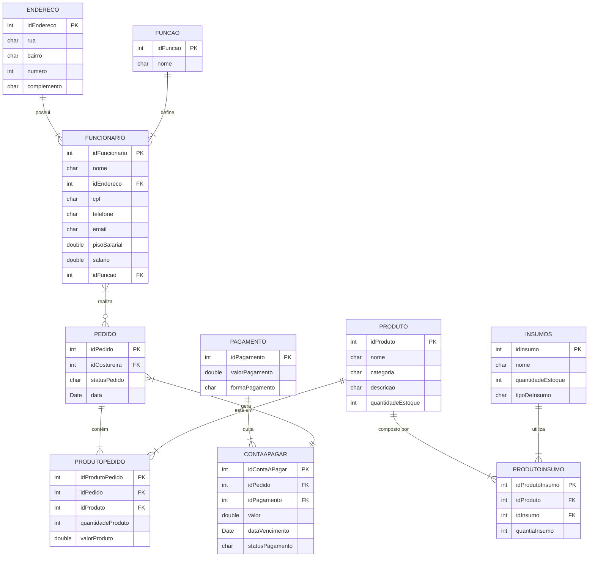

# Link direto

* [Criação do Esquema Relacional](banco_dados/create_script.sql)
* [Povoamento do Esquema Relacional](banco_dados/insert_script.sql)

## Modelo de Dados (Entidade-Relacionamento)

```mermaid
erDiagram
    ENDERECO {
        int idEndereco PK
        char rua
        char bairro
        int numero
        char complemento
    }
    ENDERECO ||--|{ FUNCIONARIO : "possui"

    FUNCAO {
        int idFuncao PK
        char nome
    }
    FUNCAO ||--|{ FUNCIONARIO : "define"

    FUNCIONARIO {
        int idFuncionario PK
        char nome
        int idEndereco FK
        char cpf
        char telefone
        char email
        double pisoSalarial
        double salario
        int idFuncao FK
    }
    FUNCIONARIO }|--o{ PEDIDO : "realiza"

    PEDIDO {
        int idPedido PK
        int idCostureira FK
        char statusPedido
        Date data
    }
    PEDIDO ||--|{ PRODUTOPEDIDO : "contém"

    PRODUTO {
        int idProduto PK
        char nome
        char categoria
        char descricao
        int quantidadeEstoque
    }
    PRODUTO ||--|{ PRODUTOPEDIDO : "está em"
    PRODUTO ||--|{ PRODUTOINSUMO : "composto por"

    PRODUTOPEDIDO {
        int idProdutoPedido PK
        int idPedido FK
        int idProduto FK
        int quantidadeProduto
        double valorProduto
    }
    

    INSUMOS {
        int idInsumo PK
        char nome
        int quantidadeEstoque
        char tipoDeInsumo
    }
    INSUMOS ||--|{ PRODUTOINSUMO : "utiliza"

    PRODUTOINSUMO {
        int idProdutoInsumo PK
        int idProduto FK
        int idInsumo FK
        int quantiaInsumo
    }
    

    PAGAMENTO {
        int idPagamento PK
        double valorPagamento
        char formaPagamento
    }
    PAGAMENTO ||--|{ CONTAAPAGAR : "quita"

    CONTAAPAGAR {
        int idContaAPagar PK
        int idPedido FK
        int idPagamento FK
        double valor
        Date dataVencimento
        char statusPagamento
    }
    PEDIDO }|--|| CONTAAPAGAR : "gera"

```
